```mermaid
flowchart TD
    %% ══════════════════════════════════════════════
    %% APP LAUNCH
    %% ══════════════════════════════════════════════
    subgraph LAUNCH["🚀 App Launch"]
        APP_START([App Opens]) --> SPLASH[Splash Screen<br/>Load fonts, init DB]
        SPLASH --> AUTH_CHECK{Session exists?}
    end

    %% ══════════════════════════════════════════════
    %% AUTH FLOW
    %% ══════════════════════════════════════════════
    subgraph AUTH["🔐 Authentication"]
        SIGN_IN[Sign In Screen<br/>Email + Password inputs]
        SIGN_UP[Sign Up Screen<br/>Name + Email + Password]
        FORGOT_PW[Forgot Password<br/>Email input]

        SIGN_IN -->|"Sign In btn"| AUTH_VALIDATE{Valid credentials?}
        AUTH_VALIDATE -->|Yes| PROFILE_CHECK{Profile fetched?}
        AUTH_VALIDATE -->|No| SIGN_IN_ERROR[Error toast] --> SIGN_IN

        SIGN_IN -->|"Sign Up link"| SIGN_UP
        SIGN_IN -->|"Forgot? link"| FORGOT_PW
        FORGOT_PW -->|"Send Reset Link btn"| RESET_SENT[Success toast] --> SIGN_IN

        SIGN_UP -->|"Sign Up btn"| SIGNUP_VALIDATE{Valid input?}
        SIGNUP_VALIDATE -->|Yes| CREATE_ACCOUNT[Create auth user<br/>+ profiles row] --> ONBOARD_START
        SIGNUP_VALIDATE -->|No| SIGN_UP_ERROR[Error toast] --> SIGN_UP
    end

    AUTH_CHECK -->|No session| SIGN_IN
    AUTH_CHECK -->|Has session| PROFILE_CHECK
    PROFILE_CHECK -->|onboarding_completed = false| ONBOARD_START
    PROFILE_CHECK -->|onboarding_completed = true| DIARY_INDEX

    %% ══════════════════════════════════════════════
    %% ONBOARDING FLOW
    %% ══════════════════════════════════════════════
    subgraph ONBOARDING["📋 Onboarding (4 steps)"]
        ONBOARD_START[Welcome Screen<br/>Feature list + brand emoji 🔥]
        INDUSTRY[Industry Select 1/4<br/>8 industry grid + niche keywords]
        PLATFORMS[Platform Setup 2/4<br/>LinkedIn toggle + X toggle<br/>Content types: Post, Carousel, Thread]
        IMAGE_STYLE[Image Style 3/4<br/>Professional 🏢 / Hand-drawn ✏️ / Minimalist ◼]
        QUOTA[Quota Config 4/4<br/>Posts per week per platform 1-7]

        ONBOARD_START -->|"Get Started btn"| INDUSTRY
        INDUSTRY -->|"Next btn"| PLATFORMS
        PLATFORMS -->|"Next btn"| IMAGE_STYLE
        IMAGE_STYLE -->|"Continue btn"| QUOTA
        QUOTA -->|"Start My Diary btn"| SAVE_ONBOARDING[Save industry, keywords,<br/>platform configs, set<br/>onboarding_completed=true]

        %% Back navigation
        INDUSTRY -.->|"Back"| ONBOARD_START
        PLATFORMS -.->|"Back"| INDUSTRY
        IMAGE_STYLE -.->|"Back"| PLATFORMS
        QUOTA -.->|"Back"| IMAGE_STYLE
    end

    SAVE_ONBOARDING --> DIARY_INDEX

    %% ══════════════════════════════════════════════
    %% TAB BAR
    %% ══════════════════════════════════════════════
    subgraph TABS["📱 Tab Bar (Floating Pill)"]
        TAB_DIARY([📓 Diary])
        TAB_CONTENT([📝 Content])
        TAB_DISCOVER([🔍 Discover])
        TAB_SETTINGS([⚙️ Settings])
    end

    TAB_DIARY --> DIARY_INDEX
    TAB_CONTENT --> CONTENT_INDEX
    TAB_DISCOVER --> DISCOVER_INDEX
    TAB_SETTINGS --> SETTINGS_INDEX

    %% ══════════════════════════════════════════════
    %% DIARY FLOW
    %% ══════════════════════════════════════════════
    subgraph DIARY["📓 Diary Flow"]
        DIARY_INDEX[Diary Home<br/>Week strip + Entry list<br/>Streak badge 🔥 + Offline banner]

        %% Header actions
        DIARY_INDEX -->|"+ btn"| NEW_ENTRY
        DIARY_INDEX -->|"☀️/🌙 btn"| TOGGLE_THEME[Toggle light/dark theme]
        TOGGLE_THEME --> DIARY_INDEX

        %% Entry list interaction
        DIARY_INDEX -->|"Tap entry card"| ENTRY_DETAIL
        DIARY_INDEX -->|"Pull to refresh"| REFRESH_ENTRIES[Refresh entries from store] --> DIARY_INDEX
        DIARY_INDEX -->|"Tap date in week strip"| FILTER_DATE[Filter entries by date] --> DIARY_INDEX

        %% Discovery countdown
        DIARY_INDEX -->|"Shows if < 7 days"| DISCOVERY_COUNTDOWN[Discovery Countdown<br/>X/7 days completed]

        %% ── New Entry ──
        subgraph NEW_ENTRY_FLOW["New Entry (Modal)"]
            NEW_ENTRY[New Entry Screen<br/>Text input auto-focus<br/>Attachment count badge]
            NEW_ENTRY -->|"🎤 btn"| AUDIO_MODAL
            NEW_ENTRY -->|"🖼️ btn"| IMAGE_MODAL
            NEW_ENTRY -->|"Save btn"| SAVE_ENTRY[Insert to SQLite<br/>Queue sync<br/>Show toast]
            NEW_ENTRY -->|"Cancel btn"| CANCEL_ENTRY[Discard + router.back]
        end

        SAVE_ENTRY --> DIARY_INDEX
        CANCEL_ENTRY --> DIARY_INDEX

        %% ── Entry Detail ──
        subgraph ENTRY_DETAIL_FLOW["Entry Detail"]
            ENTRY_DETAIL[Entry Detail Screen<br/>Full text + images + audio<br/>Sync status indicator]
            ENTRY_DETAIL -->|"✏️ Edit btn"| EDIT_ENTRY
            ENTRY_DETAIL -->|"🗑️ Delete btn"| DELETE_CONFIRM{Confirm delete?}
            ENTRY_DETAIL -->|"▶️ Play audio"| PLAY_AUDIO[Audio playback<br/>with progress bar]
            ENTRY_DETAIL -->|"Back"| DIARY_INDEX
            DELETE_CONFIRM -->|Yes| DELETE_ENTRY[Delete from SQLite<br/>+ sync queue] --> DIARY_INDEX
            DELETE_CONFIRM -->|No| ENTRY_DETAIL
        end

        %% ── Edit Entry ──
        subgraph EDIT_ENTRY_FLOW["Edit Entry (Modal)"]
            EDIT_ENTRY[Edit Entry Screen<br/>Pre-filled text + attachments]
            EDIT_ENTRY -->|"Save Changes btn"| UPDATE_ENTRY[Update SQLite<br/>Queue sync] --> ENTRY_DETAIL
            EDIT_ENTRY -->|"Cancel"| ENTRY_DETAIL
        end
    end

    %% ══════════════════════════════════════════════
    %% MODALS
    %% ══════════════════════════════════════════════
    subgraph MODALS["🪟 Modals"]
        %% ── Audio Recorder ──
        subgraph AUDIO_FLOW["Audio Recorder (Transparent Modal)"]
            AUDIO_MODAL[Audio Recorder<br/>Waveform animation]
            AUDIO_MODAL -->|"Record btn"| RECORDING[Recording...<br/>Timer counting up]
            RECORDING -->|"Stop btn"| RECORDED[Recording complete<br/>Duration shown]
            RECORDED -->|"▶️ Play btn"| PREVIEW_AUDIO[Preview playback] --> RECORDED
            RECORDED -->|"Save btn"| SAVE_AUDIO[Set pendingAudioUri<br/>in UIStore] --> NEW_ENTRY
            RECORDED -->|"Discard btn"| DISCARD_AUDIO[Clear state<br/>router.back] --> NEW_ENTRY
            AUDIO_MODAL -->|"Close/Back"| NEW_ENTRY
        end

        %% ── Image Picker ──
        subgraph IMAGE_FLOW["Image Picker (Modal)"]
            IMAGE_MODAL[Image Picker<br/>Cancel / Add Photos / Done]
            IMAGE_MODAL -->|"📷 Take Photo"| CAMERA[Camera<br/>Request permissions] --> PHOTO_TAKEN[Photo captured] --> IMAGE_GRID
            IMAGE_MODAL -->|"🖼️ Gallery"| GALLERY[Gallery picker<br/>Multi-select, max 10] --> IMAGE_GRID
            IMAGE_GRID[Selected Images Grid<br/>3-column thumbnails<br/>× to remove each]
            IMAGE_GRID -->|"Done btn"| SAVE_IMAGES[Set pendingImageUris<br/>in UIStore] --> NEW_ENTRY
            IMAGE_GRID -->|"Cancel btn"| IMAGE_MODAL_CANCEL[Clear selection<br/>router.back] --> NEW_ENTRY
        end

        %% ── Question Answer ──
        QA_MODAL[Question Answer Modal<br/>Enrichment question from notification]
    end

    %% ══════════════════════════════════════════════
    %% CONTENT FLOW
    %% ══════════════════════════════════════════════
    subgraph CONTENT["📝 Content Flow"]
        CONTENT_FLAG{content_generation<br/>feature flag?}
        CONTENT_INDEX[Content Screen]
        CONTENT_INDEX --> CONTENT_FLAG
        CONTENT_FLAG -->|Off| CONTENT_COMING_SOON[Coming Soon<br/>📝 placeholder]
        CONTENT_FLAG -->|On| CONTENT_LIST[Generated Posts List<br/>Filter by platform/status]

        CONTENT_LIST -->|"Tap post"| POST_DETAIL[Post Detail<br/>Title + body + metadata]
        CONTENT_LIST -->|"Queue btn"| CONTENT_QUEUE[Content Queue Modal<br/>Pending items]

        POST_DETAIL -->|"Edit"| EDIT_POST[Edit post content]
        POST_DETAIL -->|"Copy"| COPY_POST[Copy to clipboard]
        POST_DETAIL -->|"Preview"| POST_PREVIEW[Post Preview Modal<br/>Platform-specific render]
        POST_DETAIL -->|"Back"| CONTENT_LIST

        EDIT_POST -->|"Save"| POST_DETAIL
    end

    %% ══════════════════════════════════════════════
    %% DISCOVER FLOW
    %% ══════════════════════════════════════════════
    subgraph DISCOVER["🔍 Discover Flow"]
        DISCOVER_FLAG{creator_discovery<br/>feature flag?}
        DISCOVER_INDEX[Discover Screen]
        DISCOVER_INDEX --> DISCOVER_FLAG
        DISCOVER_FLAG -->|Off| DISCOVER_COMING_SOON[Coming Soon<br/>🔍 placeholder]
        DISCOVER_FLAG -->|On| DISCOVER_UNLOCK{discovery_unlocked<br/>OR >= 7 diary days?}

        DISCOVER_UNLOCK -->|No| DISCOVER_LOCKED[Locked View<br/>X/7 days completed<br/>Go to Diary btn]
        DISCOVER_LOCKED -->|Go to Diary btn| DIARY_INDEX

        DISCOVER_UNLOCK -->|Yes| DISCOVER_MAIN[Discover Main<br/>Platform filter dropdown<br/>Creator list]

        DISCOVER_MAIN -->|"Find Creators btn"| SCRAPE[Trigger scrape + analyze<br/>Loading spinner<br/>Toast on complete]
        SCRAPE --> DISCOVER_MAIN

        DISCOVER_MAIN -->|"Tap creator card"| CREATOR_DETAIL[Creator Detail<br/>Profile + content samples<br/>Platform links]
        DISCOVER_MAIN -->|"Profiles link"| WRITING_PROFILES[Writing Profiles List<br/>Creator style analysis]
        DISCOVER_MAIN -->|"Pull to refresh"| REFRESH_CREATORS[Refresh profiles] --> DISCOVER_MAIN
        DISCOVER_MAIN -->|"Platform filter"| FILTER_PLATFORM[Filter: All/LinkedIn/X] --> DISCOVER_MAIN

        CREATOR_DETAIL -->|"Back"| DISCOVER_MAIN
        WRITING_PROFILES -->|"Back"| DISCOVER_MAIN
    end

    %% ══════════════════════════════════════════════
    %% SETTINGS FLOW
    %% ══════════════════════════════════════════════
    subgraph SETTINGS["⚙️ Settings Flow"]
        SETTINGS_INDEX[Settings Home<br/>Profile card + menu sections]

        %% Profile card
        SETTINGS_INDEX -->|"Profile card tap"| ACCOUNT

        %% Platforms section
        SETTINGS_INDEX -->|"📱 Platforms & Quotas"| PLATFORMS_SETTINGS[Platforms Screen<br/>Toggle platforms, set quotas]
        SETTINGS_INDEX -->|"✍️ Writing Style"| WRITING_STYLE

        %% Profile section
        SETTINGS_INDEX -->|"🏭 Industry & Niche"| INDUSTRY
        SETTINGS_INDEX -->|"🎨 Image Style"| IMAGE_STYLE
        SETTINGS_INDEX -->|"👤 Account Details"| ACCOUNT

        %% Preferences section
        SETTINGS_INDEX -->|"🎨 Appearance"| APPEARANCE_PICKER{Alert: Light / Dark / Auto}
        APPEARANCE_PICKER -->|Select| SET_THEME[setThemeMode] --> SETTINGS_INDEX

        SETTINGS_INDEX -->|"🔔 Notifications"| NOTIFICATIONS[Notifications Settings]

        %% Data section
        SETTINGS_INDEX -->|"📤 Export Diary"| EXPORT[Export Screen<br/>Download diary data]
        SETTINGS_INDEX -->|"🗑️ Delete Account"| DELETE_ACCOUNT_CONFIRM{Confirm delete?}
        DELETE_ACCOUNT_CONFIRM -->|Yes| ACCOUNT
        DELETE_ACCOUNT_CONFIRM -->|No| SETTINGS_INDEX

        %% Sign Out
        SETTINGS_INDEX -->|"🚪 Sign Out"| SIGN_OUT_CONFIRM{Confirm sign out?}
        SIGN_OUT_CONFIRM -->|Yes| SIGN_OUT[Clear session<br/>supabase.auth.signOut] --> SIGN_IN
        SIGN_OUT_CONFIRM -->|No| SETTINGS_INDEX

        %% ── Writing Style ──
        subgraph WRITING_STYLE_FLOW["Writing Style"]
            WRITING_STYLE[Writing Style Screen<br/>Platform tabs: LinkedIn / X]
            WRITING_STYLE -->|"Tab: LinkedIn"| WS_LINKEDIN[LinkedIn instructions<br/>Text area]
            WRITING_STYLE -->|"Tab: X"| WS_X[X instructions<br/>Text area]
            WS_LINKEDIN -->|"Save btn"| SAVE_WS[Upsert to<br/>user_writing_instructions] --> WRITING_STYLE
            WS_X -->|"Save btn"| SAVE_WS
            WRITING_STYLE -->|"Back"| SETTINGS_INDEX
        end

        %% ── Account ──
        subgraph ACCOUNT_FLOW["Account"]
            ACCOUNT[Account Screen<br/>Edit name, email, avatar]
            ACCOUNT -->|"Save"| UPDATE_PROFILE[Update profiles table] --> ACCOUNT
            ACCOUNT -->|"Back"| SETTINGS_INDEX
        end

        %% Sub-screen back navigation
        PLATFORMS_SETTINGS -->|"Back"| SETTINGS_INDEX
        NOTIFICATIONS -->|"Back"| SETTINGS_INDEX
        EXPORT -->|"Back"| SETTINGS_INDEX
    end

    %% ══════════════════════════════════════════════
    %% BACKGROUND PROCESSES
    %% ══════════════════════════════════════════════
    subgraph BACKGROUND["⚡ Background Processes"]
        SYNC[Sync Service<br/>SQLite → Supabase<br/>On mount + 15min interval]
        PUSH_NOTIF[Push Notifications<br/>enrichment_question type]
        BG_FETCH[Background Fetch<br/>syncPendingEntries]

        PUSH_NOTIF -->|"User taps notification"| QA_MODAL
        SYNC -->|"create_entry"| EDGE_SYNC[sync-diary edge function]
        SYNC -->|"upload_image"| EDGE_IMAGE[Storage upload + diary_images insert]
    end

    %% ══════════════════════════════════════════════
    %% CONTENT GENERATION (Edge Functions)
    %% ══════════════════════════════════════════════
    subgraph GENERATION["🤖 Content Generation Pipeline"]
        GEN_START([User triggers generate]) --> FETCH_ENTRY[Fetch diary entry text]
        FETCH_ENTRY --> FETCH_CONTEXT[Fetch writing profile<br/>+ user persona<br/>+ custom instructions<br/>+ industry]
        FETCH_CONTEXT --> RAG{Embeddings enabled?}
        RAG -->|Yes| SEMANTIC[Semantic retrieval<br/>5 similar entries]
        RAG -->|No| CHRONO[Chronological<br/>last 3 entries]
        SEMANTIC --> BUILD_PROMPT
        CHRONO --> BUILD_PROMPT
        BUILD_PROMPT[Build prompt<br/>Select by platform + type] --> LLM_CALL[OpenRouter API call<br/>DeepSeek V3]
        LLM_CALL --> EXTRACT_TOOL[Extract tool use output]
        EXTRACT_TOOL --> HUMANISE[Humanise pass<br/>Remove AI-isms<br/>12 anti-AI rules]
        HUMANISE --> SAVE_POST[Insert generated_posts<br/>status: draft]
    end

    %% ══════════════════════════════════════════════
    %% STYLING
    %% ══════════════════════════════════════════════
    classDef screen fill:#1a1a2e,stroke:#16213e,color:#e0e0e0
    classDef action fill:#0f3460,stroke:#533483,color:#e0e0e0
    classDef decision fill:#533483,stroke:#e94560,color:#e0e0e0
    classDef modal fill:#2d1b69,stroke:#7b2ff7,color:#e0e0e0
    classDef background fill:#1b2838,stroke:#2a475e,color:#e0e0e0

    class SIGN_IN,SIGN_UP,FORGOT_PW,DIARY_INDEX,ENTRY_DETAIL,NEW_ENTRY,EDIT_ENTRY,CONTENT_INDEX,DISCOVER_INDEX,SETTINGS_INDEX,ACCOUNT,WRITING_STYLE screen
    class SAVE_ENTRY,DELETE_ENTRY,UPDATE_ENTRY,SAVE_AUDIO,SAVE_IMAGES,SIGN_OUT,SAVE_WS action
    class AUTH_CHECK,PROFILE_CHECK,CONTENT_FLAG,DISCOVER_FLAG,DISCOVER_UNLOCK,AUTH_VALIDATE decision
    class AUDIO_MODAL,IMAGE_MODAL,QA_MODAL,POST_PREVIEW modal
    class SYNC,PUSH_NOTIF,BG_FETCH,EDGE_SYNC background
```

# Founder Diaries — Complete UX Flow Diagram

## How to read this diagram

- **Rectangles** = Screens
- **Diamonds** = Decision points
- **Rounded boxes** = Actions/buttons
- **Dotted lines** = Conditional paths (feature flags, unlock gates)
- **Subgraphs** = Flow groups (Auth, Onboarding, Diary, etc.)

---

---

## Screen Inventory

| # | Screen | Route | Presentation |
|---|--------|-------|-------------|
| 1 | Sign In | `/(auth)/sign-in` | Stack |
| 2 | Sign Up | `/(auth)/sign-up` | Stack |
| 3 | Forgot Password | `/(auth)/forgot-password` | Stack |
| 4 | Welcome | `/(onboarding)/welcome` | Stack |
| 5 | Industry Select | `/(onboarding)/industry-select` | Stack |
| 6 | Platform Setup | `/(onboarding)/platform-setup` | Stack |
| 7 | Image Style | `/(onboarding)/image-style` | Stack |
| 8 | Quota Config | `/(onboarding)/quota-config` | Stack |
| 9 | Diary Home | `/(tabs)/diary/index` | Tab |
| 10 | New Entry | `/(tabs)/diary/new` | Modal |
| 11 | Entry Detail | `/(tabs)/diary/[date]` | Stack |
| 12 | Edit Entry | `/(tabs)/diary/edit/[localId]` | Modal |
| 13 | Content Home | `/(tabs)/content/index` | Tab |
| 14 | Post Detail | `/(tabs)/content/[postId]` | Stack |
| 15 | Content Queue | `/(tabs)/content/queue` | Modal |
| 16 | Discover Home | `/(tabs)/discover/index` | Tab |
| 17 | Creator Detail | `/(tabs)/discover/[creatorId]` | Stack |
| 18 | Writing Profiles | `/(tabs)/discover/profiles` | Stack |
| 19 | Settings Home | `/(tabs)/settings/index` | Tab |
| 20 | Platforms & Quotas | `/(tabs)/settings/platforms` | Stack |
| 21 | Writing Style | `/(tabs)/settings/writing` | Stack |
| 22 | Account | `/(tabs)/settings/account` | Stack |
| 23 | Export | `/(tabs)/settings/export` | Stack |
| 24 | Notifications | `/(tabs)/settings/notifications` | Stack |
| 25 | Audio Recorder | `/(modals)/audio-recorder` | Transparent Modal |
| 26 | Image Picker | `/(modals)/image-picker` | Modal |
| 27 | Post Preview | `/(modals)/post-preview` | Modal |
| 28 | Question Answer | `/(modals)/question-answer` | Modal |

## Button/Action Inventory

| Screen | Action | Target | Type |
|--------|--------|--------|------|
| Sign In | Sign In | Auth validate → Diary/Onboarding | Submit |
| Sign In | Sign Up link | Sign Up screen | Navigate |
| Sign In | Forgot? link | Forgot Password screen | Navigate |
| Sign Up | Sign Up | Create account → Onboarding | Submit |
| Forgot Password | Send Reset Link | Email sent toast | Submit |
| Welcome | Get Started | Industry Select | Navigate |
| Industry Select | Next | Platform Setup | Navigate |
| Platform Setup | Next | Image Style | Navigate |
| Image Style | Continue | Quota Config | Navigate |
| Quota Config | Start My Diary | Save config → Diary Home | Submit |
| Diary Home | + (Add) | New Entry modal | Navigate |
| Diary Home | Theme toggle | Toggle light/dark | Action |
| Diary Home | Tap entry card | Entry Detail | Navigate |
| Diary Home | Pull to refresh | Refresh entries | Action |
| Diary Home | Tap date (week strip) | Filter by date | Action |
| New Entry | Save | Insert entry → Diary Home | Submit |
| New Entry | Cancel | Discard → Diary Home | Navigate |
| New Entry | 🎤 Voice | Audio Recorder modal | Navigate |
| New Entry | 🖼️ Image | Image Picker modal | Navigate |
| Entry Detail | ✏️ Edit | Edit Entry modal | Navigate |
| Entry Detail | 🗑️ Delete | Confirm → Delete → Diary Home | Action |
| Entry Detail | ▶️ Play | Audio playback | Action |
| Edit Entry | Save Changes | Update → Entry Detail | Submit |
| Audio Recorder | Record | Start recording | Action |
| Audio Recorder | Stop | Stop recording | Action |
| Audio Recorder | Play | Preview playback | Action |
| Audio Recorder | Save | Set pending URI → New Entry | Submit |
| Audio Recorder | Discard | Clear → New Entry | Navigate |
| Image Picker | Take Photo | Camera → Grid | Action |
| Image Picker | Choose Gallery | Gallery picker → Grid | Action |
| Image Picker | Done | Set pending URIs → New Entry | Submit |
| Image Picker | Cancel | Clear → New Entry | Navigate |
| Discover | Find Creators | Scrape + analyze | Action |
| Discover | Tap creator | Creator Detail | Navigate |
| Discover | Profiles link | Writing Profiles | Navigate |
| Discover | Platform filter | Filter list | Action |
| Discover Locked | Go to Diary | Diary Home | Navigate |
| Settings | Profile card | Account | Navigate |
| Settings | Platforms & Quotas | Platforms settings | Navigate |
| Settings | Writing Style | Writing Style | Navigate |
| Settings | Industry & Niche | Onboarding Industry | Navigate |
| Settings | Image Style | Onboarding Image Style | Navigate |
| Settings | Appearance | Theme picker alert | Action |
| Settings | Notifications | Notifications settings | Navigate |
| Settings | Export Diary | Export screen | Navigate |
| Settings | Delete Account | Confirm → Account | Action |
| Settings | Sign Out | Confirm → Sign In | Action |
| Writing Style | Tab: LinkedIn/X | Switch platform | Action |
| Writing Style | Save Instructions | Upsert to DB | Submit |
